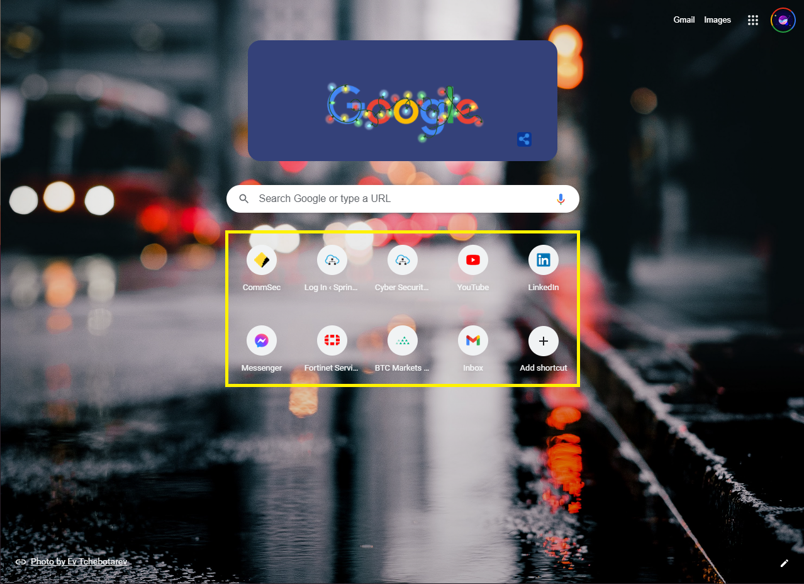

# Shortcut Grids

This is part of my new journey to learn React JS and maybe even React Native down the line. I had the idea for shortcut grids for a while but never had the right tools to bring it to life. Sure, I knew how to build this using Flutter but, since Flutter isnt stable yet for web, I was never motivated to build it out. So here goes... I had this idea when I constantly found myself opening a new tab on Chrome to only have click on one of the shortcuts shown below.  

I felt that I could build something better and much more useful. First of all, in the shortcuts shown above, you can only have a maximum of 10 shortcuts and I wasn't able to customise the look and size of the shortcut rows itself. I wanted to build a web app that is shown first thing when I open Chrome or a new tab with a whole bunch of customisable shortcut grids. This is how the idea for Shortcut Grids came around. This being my first React project, hope this will be useful to someone out there! Enjoy! 
